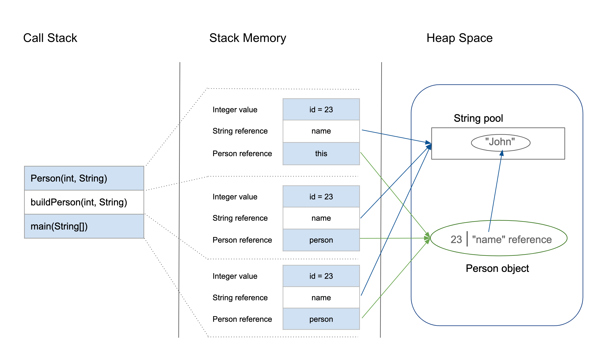

# R and C/C++ notes for exam on 23rd of May

# C/C++
1. [I/O device](https://www.techtarget.com/whatis/definition/input-output-I-O)
	- I/O device is the device that transfers data to or from a computer
	- printers, hard disks, keyboards, and mouses
2. [von Neumann architecture](https://en.wikipedia.org/wiki/Von_Neumann_architecture)
	- A processing unit with both an arithmetic logic unit and processor registers
	- A control unit that includes an instruction register and a program counter
	- Memory that stores data and instructions
	- External mass storage
	- Input and output mechanisms
3. [Low-Level language](https://en.wikipedia.org/wiki/Low-level_programming_language)
	- is a programming language that provides little or no abstraction from a computer's instruction set architecture—commands or functions in the language map that are structurally similar to processor's instructions
	- Machine code, Assembly language...
4. [high-level language](https://en.wikipedia.org/wiki/High-level_programming_language)
	- is a programming language with strong abstraction from the details of the computer
	- C/C++, python, R, MATLAB...
5. stack memory diagram 
6. `malloc` and `free`
	- `malloc` **allocates** ==heap memory== for your program
	- `free` **releases** the ==heap memory== you just allocated
7. [pointers](https://www.tutorialspoint.com/cprogramming/c_pointers.htm)
	- A pointer is a variable whose value is the **address** of another variable, i.e., direct address of the memory location
	- pointers are the variables that are denoted `variable_type *variable_name`, that will set this variable to an unique address
	- `%p` can be writen in a print statement, it will let computer know that this variable will be print out as printer form
8. [PP (Procedure Programming)](https://www.techopedia.com/definition/21481/procedural-programming)
	- is a programming paradigm that uses a linear or top-down approach. It relies on procedures or subroutines to perform computations
	- PP divides your program into subtasks and you write procedures for each subtask
9. [OOP (Object Oriented Programming)](https://en.wikipedia.org/wiki/Object-oriented_programming)
	- is a programming paradigm based on the concept of **"objects"**, which can contain data and code
	- data in the form of ==fields== (often known as attributes or properties)
	- and code, in the form of procedures (AKA ==methods==).
	- OOP divides your program into objects which contains methods and fields
10. R programming
	- R is a high-level **tatistical programming language**
	- R is very effcient at vectors and matrices operations, large datasets processing and data visualization

# R programming
to download the R programming book, press [download](https://zh.uk1lib.vip/book/1220151/dace69) button
1. datatype
	- R have 5 datatypes, they are `intager`, `numerical (double)`, `characters`, `logical` and `complex`. Logical is `TRUE` or `FALSE` 
	- to check the datatype, enter `typeof(variable_name)`
2. arithmetic
	- modular `num1%%num2`, intager division `num1%/%num2` or `num1/num2` and exponentiation `num1^num2`
3. functions
	- to write your own function, enter `function_name = function(argument1, argument2){#code here}`
	- to return a variable, enter `return(variable_name)`
4. vectors
	- vectors can be writen as `c()` in R, `vector1 = c(1, 2, 3, 4)`
5. indexing vectors
	- the indexing of a vector or array is ==start from 1 not 0==.
	- if the indexing of a vector is outside of the vector length, it will display `NA` as **not a number**
	- the negative indexing `-number` is the vector elements except the `number`th elements in a vector
	- to delete some elements, enter `c[c(-a, -b)]` where a and b are the indexing of the vector that you want to delete
6. smybols
	- `num1:num2` symbol is the same as the `for (int i=num1; i<num2; i++)` in C and `in range(num1, num2)` in Python
	- to get the length of the vector or array, enter `length(variable_name)`
7. matrix
	- to set the variables in a matrix, enter `matrix(vector, nrow)`
	- to get the dimentions of the matrix, enter `dim(matrix_name)`, `dim(matrix_name)[1]` is the number of rows and `dim(amtrix_name)[2]` is the number of columns
	- indexing elements of matrix, `amrix_name[i, j]`, for i = nrow and j = ncol
	- to access row_{i} of matrix by using `matrix_name[i,]` and col_{j} of matrix by using `matrix_name[,j]`
8. `cbind` and `rbind`
	- `cbind(a, b)` can combined a and b at column side, `rbind(a, b)` can combined a and b at row side
	- to delete the rows or columns of matrix, enter `matrix[-a,]` or `matrix[,-b]` where a is the row indexing of the matrix and b is the column indexing of the matrix
9. `apply`
	- function `apply` can apply a function that are builtin functions i.e. mean, sd or your own functions for better calculation
10. graphs 101
	- `plot(a, b, type="n", xlab="x", ylab="y")` can plot a blank/empty graph that are set as range a x-axis and b y-axis with x-label x and y-label y
	- `points(a, b, col="<color>")` can plot the points for 1 `a` value and 1 `b` value for their x and y coordinates and `col` is the color ot plot with
11. logical operators
	- `&&` is the same as `and` in Python
	- `||` is the same as `or` in Python
	- these operators are normally used in if statements
12. list
	- to generate lists, enter `list(a, b)` to run `[[1]]` and `[[2]]`, if you want to note the names, enter `list(name1=a, name2=b)`, it will display `$name1` and `$name2`
	- if you want to run the spceific name for future variable setting, enter `variable_name = list_name$name1/name2`
	- to add an element to list, enter `list_name$name3 = variable`
	- to delete an element from list, enter `list_name$name_number = NULL`
13. dataframe
	- to create a dataframe, enter `data.frame(a, b, c, ...)` or simply using `list(a, b, c, ...)`
14. summary
	- to summary the dataframe, enter `summary(list)` or `summary(dataframe)`
	- indexing dataframe, is the same as the matrix indexing, `dataframe[i, j]`
15. [OOP in R](https://data-flair.training/blogs/object-oriented-programming-in-r/)
	- to create your own class, enter `class(class_name)`, class_name have to be `list()` or `data.frame()`
	- make sure to create class with some sense, i.e., `cube = list(height=70, width=150, depth=50)`, `class(cube) = "student"`. it doesn't work on progrmming but it doesn't make any sense because the class of cube is student
	- it is very dangrous to change class for the variables of builtin classes i.e., `dataset = data.frame(1:4, 2:5)`, `class(dataset)` should be display `data.frame` but if you change the class of the dataset `class(dataset) = "student"`, then it is not going to work
16. [polymorphism](https://www.geeksforgeeks.org/polymorphism-in-r-programming/)
	- polymorphism in computer science means **a single interface for different data type**
	- means same functions will behave differently for objects from different classes
17. R help
	- to get help from R programming, simply enter `help(function)` or `?function` to see more further details

## C/C++
### memory in C
- stack memory
```c
int i = 10;
int arr[] = {1, 3, 5, 7, 9};
float price = 10.5;
```
you don't have to free the memory because stack memeory only store temporarily
- heap memory
```c
int num;
int *number = malloc(num*sizeof(int)); // set them that they cannot be changed or overlapped with larger memeory size
free(number) //don't forget to free the memory after finish using this variable
```
you have to free the heap memory at the end of script

### euclidean distance
equation: $dist(a, b) = \sqrt{\sum_{k=1}^{K}\left ( a_{k} - b_{k} \right )^{2}}$
code in R
```R
n = 100
for (i in 1:n){
	for (j in 1:n){
		D[i,j] = sqrt(sum(A[i,]-B[j,])^2)
	}
}
```
code in C
```c
#include <math.h>
void edist(A, B, C){
	for (int i=0; i<A[i,]; i++){
		for (int j=0; j<B[i,], j++){
			C[i, j] = 0;
			for (int k=0; k<A[,j]; k++){
				C[i, j] += (A[i, k]-B[j, k])*(A[i, k]-B[j, k]);
			}
			D[i, j] = sqrt(C[i, j]);
		}
	}
}
```

### calculate length of an array in C
```c
#include <math.h>
#include <stdio.h>
void cal_length(double a[], int len){
	double s = 0;
	for (int i=0; i<len; i++){
		s += a[i]*a[i];
	}
	sum = sqrt(s);
	return sum;
}
```

### pointer in C
```c
#include <stdio.h>
int main(){
	int a = 1; int *pa = &a;
	printf("%p", pa);
	//will display 0000000a6f3ffa0c
}

int main(){
	int a = 1; int *pa = &a;
	printf("%d", *pa);
	//will display 1
}
```
`a[k]` is equivalent to `*(a+k)` is equivalent to `pa[k]`
to return a pointer, `return pa;` is fine
`calloc` is to allocate and clear heap memory
```c
//malloc
int *pvariable_name = malloc(num * sizeof(int));

//calloc
int *pavriable_name = calloc(num, sizeof(int));
```
`realloc` is to reallocate heap memory
```c
int pnew_variable_name = realloc(variable_name, new_num*sizeof(int)); //for reallocate a new size
```
==don;t forget to **free** the heap memory!==

### find the minimum in C
```c
#include <stdio.h>
int find_minimum(int len, double array[len]){
	double min = ind_max;
	int ind = -1;
	for (int i=0; i<len; i++){
		if (array[i]<min){
			min = array[i];
			ind = i;
		}
	}
	return i;
}
```

### find three top numbers in C
```c
#include <stdio.h>
//set top[3] to three very big numbers i.e., top[3] = {999, 999, 999};
int find_top3(int len, double array[len], double top[3]){
	int top_index = find_minmum(len, array);
	for (int i=0; i<2; i++){
		for (int j=0; j<3; j++){
			top[j] = array[top_index];
		}
		array[top_index] = ind_max;
	}
	return array;
}
```

### swap two numbers in C
```c
#include <stdio.h>
int swap(int *a, int *b){
	int tmp = 0;
	if (a>b){
		tmp = *b;
		*b = *a;
		*a = tmp;
	}
}
```

### OOP (Object Oriented Programming) in C++ and structure in C
OOP in C++
```cpp
class __class__{
	int vars1, vars2, vars3;
public: 
	void function_name1(vars1){# code here}
	void function_name2(vars2){# code here}
	void function_name3(vars3){# code here}
};

int main(){
	__class__ variable;
	variable.function_anme1(vars1);
	variable.function_name2(vars2);
	variable.function_anme3(vars3);
}
```
structure in C
```c
struct __class__{
	int variable1;
	int variable2;
	int variable3;
};

typedef struct __class__ class;
```

## R programming
### levels of vectorization
```r
#level 1
dist1 = function(a, b){
	c = matrix(0, nrow=dim(a)[1], ncol=dim(b)[2])
	for (i in 1:dim(1)[1]){
		for (j in 1:dim(b)[2]){
			for (k in 1:dim(a)[2]){
				c[i, j] = c[i, j]+a[i, k]*b[k, j]
			}
		}
	}
	return(c)
}

#level 2
dist2 = function(a, b){
	c = matrix(0, nrow=dim(a)[1], ncol=dim(b)[2])
	for (i in 1:dim(a)[1]){
		for (j in 1:dim(b)[2]){
			c[i, j] = a[i,]*b[,j]
		}
	}
	return(c)
}

#level 3
dist3 = function(a, b){
	c = matrix(0, nrow=dim(a)[1], ncol=dim(b)[2])
	for (i in 1:dim(a)[1]){
		c[i,] = a[i,]%*%b
	}
	return(c)
}

#level 4
dist4 = function(a, b){
	return(sum(a-b)^2)
}
```

### pair-wise distance in R
equation: $dist(a, b) := \left ( \sum_{k}^{}\left| a_{k}-b_{k}\right|^{p} \right )^{\frac{1}{p}}$
```r
#version 1
pdist1 = function(A, B){
	D = matrix(0, nrow = dim(A)[1], ncol = dim(B)[1])
	for (i in 1:dim(A)[1]){
		for (j in 1:dim(B)[1]){
			for (k in 1:dim(A)[2]){
				D[i,j] = D[i,j]+(A[i,k]-B[j,k])^2
			}
			D[i,j] = sqrt(D[i,j])
		}
	}
	return(D)
}

#version 2
pdist2 = function(A, B){
	D = matrix(0, nrow = dim(A)[1], ncol = dim(B)[1])
	for (i in 1:dim(A)[1]){
		for (j in 1:dim(B)[1]){
			D[i, j] = sqrt(sum(A[i,]-B[j,])^2)
		}
	}
	return(D)
}
```

## mock exam paper
### print the following output in C
```c
void main(){
	for (int i=0; i<9; i++){
		for (int j=0; j<i%3+1; j++){
			printf("*");
		}
		printf("\n");
	}
}
```
the final output is:
```
*
**
***
*
**
***
*
**
***
```

### calculate the prime number with 2 apart in R
```R
n = 100
last_prime = 2
for (i in 2:n){
	is_prime = TRUE
	for (j in 2:(i-1)){
		if (i%%j==0){
			is_prime = FALSE
		}
	}
	if (is_prime){
		if (i-last_prime==2){
			cat(paste(last_prime, ",", i))
		}
		last_prime = i
	}
}
```
to make this script run faster
modify `for (i in 2:n)` to `for (i in c(2, seq(3, n, 2)))`
or add `break` after `is_prime = FALSE` to breakdown if `is_prime` is ==**false**==

### OOP in C++
Add three private fields in `shop_item` class: `name` stores a string, `quantity` stores a integer, `price` stores a decimal number
Add public methods in `shop_item` class, so that you can set values to the fields you have just defined. Note, `quantity` and `price` must be positive
Add code in main function, so that coke's name is set to `"coca cola"` , quantity is set to `100` and price is set to `1.2f`
```cpp
class shop_item{
	char *name;
	int quantity;
	float price;
public:
	void set_name(char *name){name = n;}
	void set_quantity(int q){quantity = q;}
	void set_price(int p){price = p;}
}

int main(){
	shop_item coke;
	coke.set_name("coca cola");
	coke.set_quantity(100);
	coke.set_price(1.2f);
}
```
